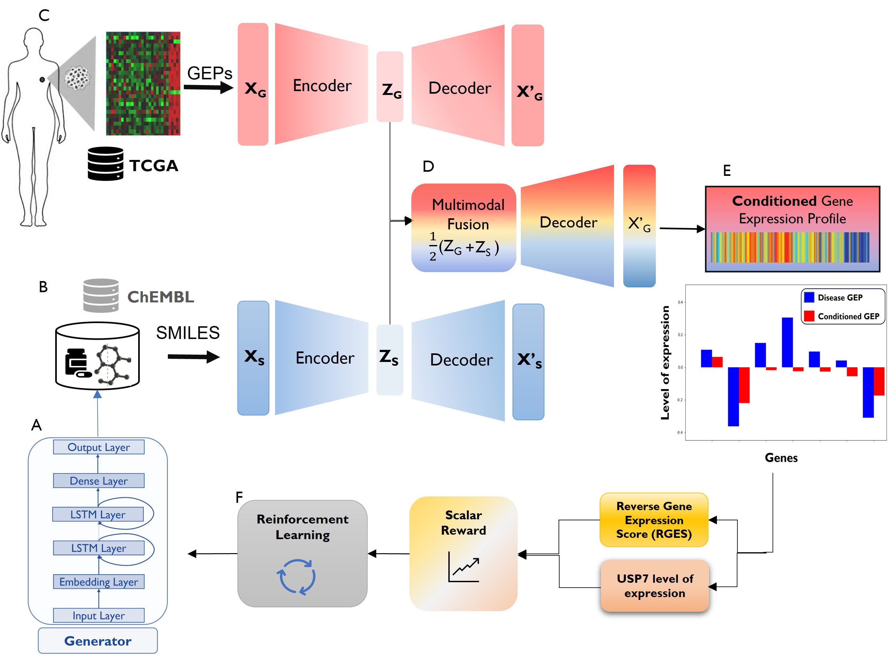
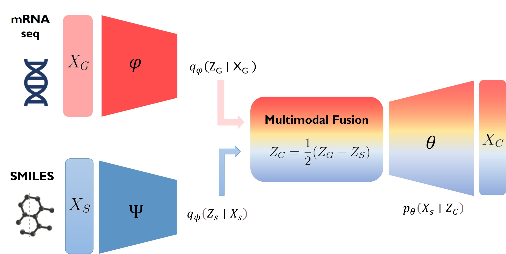
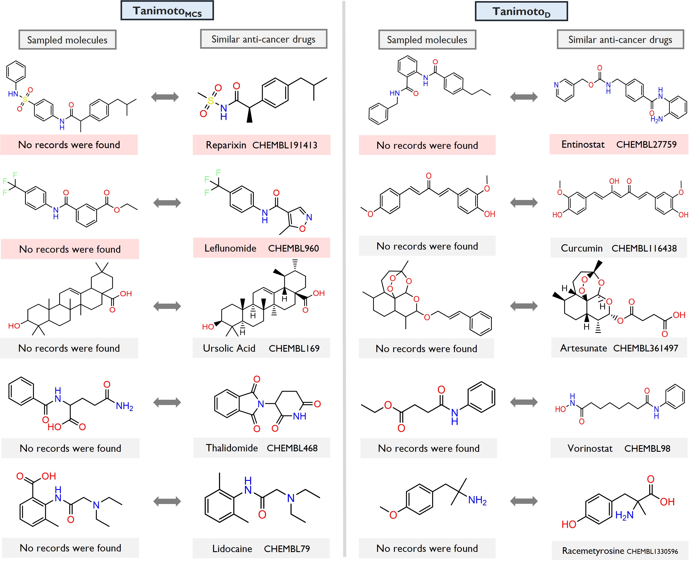

# Conditioned GEP for the de novo molecular generation

## Paper information
To be confirmed

## General Workflow
   

## Implementation
- Set up your anaconda environment with the following code: conda env create -f research_gep_denovo_generation.yml
- Run main.py file

## Dependencies
All dependencies are described in the research_gep_denovo_generation.yml file
